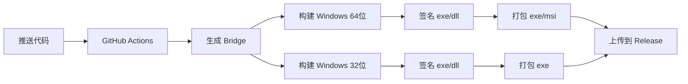

# 🎯 RustDesk Windows 构建配置

本项目已配置为**仅构建 Windows 应用**，并使用**测试签名证书**。

---

## 🚀 立即开始

### 📖 选择您的路径

#### 🎯 我想快速开始（推荐）
👉 阅读 [QUICK_START.md](./QUICK_START.md)  
⏱️ 5 分钟完成配置

#### 📚 我想了解详细信息
👉 阅读 [WINDOWS_ONLY_BUILD_SETUP.md](./WINDOWS_ONLY_BUILD_SETUP.md)  
📖 完整的配置指南和故障排查

#### 🔍 我想查看所有更改
👉 阅读 [CHANGES_SUMMARY.md](./CHANGES_SUMMARY.md)  
📝 详细的修改记录

---

## ⚡ 3 步配置流程

```
1. 生成测试证书      2. 配置 GitHub        3. 触发构建
   (Windows 上)         Secrets              
                                            
   ┌──────────┐       ┌──────────┐        ┌──────────┐
   │ 运行脚本  │  -->  │ 添加密钥  │  -->   │ 推送代码  │
   └──────────┘       └──────────┘        └──────────┘
        ↓                   ↓                   ↓
   生成证书文件        复制到 GitHub       自动构建
```

---

## 📦 您将获得什么

构建完成后，在 GitHub Releases 中下载：

```
📁 rustdesk-1.4.3-x86_64.exe      ← 64位自解压安装程序 ✅ 已签名
📁 rustdesk-1.4.3-x86_64.msi      ← 64位 MSI 安装包    ✅ 已签名  
📁 rustdesk-1.4.3-x86-sciter.exe  ← 32位版本          ✅ 已签名
```

---

## 🔐 签名状态

### ✅ 已配置

- Windows 代码签名（使用测试证书）
- 自动签名 exe、dll、msi 文件
- 时间戳支持（证书过期后仍可验证）

### ⚠️ 测试证书警告

使用测试证书时，用户会看到：

```
┌─────────────────────────────────────┐
│  Windows 已保护你的电脑              │
│  Microsoft Defender SmartScreen     │
│  阻止了未识别的应用启动              │
│                                     │
│  [更多信息]  [取消]                  │
└─────────────────────────────────────┘
```

**解决方法：** 点击"更多信息" → "仍要运行"

**生产环境建议：** 购买正式的代码签名证书（约 $200-600/年）

---

## 🎛️ 已禁用的平台

以下平台已禁用，不会构建：

- ❌ macOS (x86_64, aarch64)
- ❌ iOS
- ❌ Android
- ❌ Linux (deb, rpm, AppImage, Flatpak)

**如需重新启用：** 编辑 `.github/workflows/flutter-build.yml`，删除对应的 `if: false` 行

---

## 📋 需要的 GitHub Secrets

### 必需配置

| Secret 名称 | 值 | 获取方式 |
|------------|-----|---------|
| `WINDOWS_CERTIFICATE_BASE64` | (证书 Base64) | 运行 `create-test-certificate.ps1` |
| `WINDOWS_CERTIFICATE_PASSWORD` | `RustDeskTest2024!` | 脚本生成的默认密码 |

### 配置步骤

```
GitHub 仓库 
  → Settings 
    → Secrets and variables 
      → Actions 
        → New repository secret
```

---

## 🛠️ 脚本和工具

### 证书生成

```powershell
# Windows PowerShell（管理员身份）
./res/create-test-certificate.ps1
```

### 手动签名（本地测试）

```powershell
# 设置环境变量
$env:WINDOWS_CERTIFICATE_BASE64 = "..."
$env:WINDOWS_CERTIFICATE_PASSWORD = "RustDeskTest2024!"

# 运行签名
./res/sign-windows.ps1 -FilePath "./build/output"
```

### 验证签名

```powershell
# 查看签名信息
Get-AuthenticodeSignature "rustdesk.exe" | Format-List *

# 或右键点击文件 → 属性 → 数字签名
```

---

## 📚 文档索引

| 文档 | 用途 | 推荐人群 |
|------|------|---------|
| [QUICK_START.md](./QUICK_START.md) | 快速开始 | 所有用户 ⭐ |
| [WINDOWS_ONLY_BUILD_SETUP.md](./WINDOWS_ONLY_BUILD_SETUP.md) | 完整指南 | 需要详细说明 |
| [CHANGES_SUMMARY.md](./CHANGES_SUMMARY.md) | 更改记录 | 维护者 |
| [SIGNING_GUIDE.md](./SIGNING_GUIDE.md) | 签名详解 | 高级配置 |
| [SIGNING_WORKFLOW_CHANGES.md](./SIGNING_WORKFLOW_CHANGES.md) | 工作流修改 | 开发者 |
| [QUICK_SIGNING_SETUP.md](./QUICK_SIGNING_SETUP.md) | 快速参考 | 快速查询 |

---

## 🔄 构建流程



---

## ⏱️ 构建时间

| 阶段 | 时间 |
|------|------|
| 生成 Bridge | ~5 分钟 |
| Windows 64位构建 | ~15-25 分钟 |
| Windows 32位构建 | ~10-15 分钟 |
| 签名和打包 | ~2-5 分钟 |
| **总计** | **~30-45 分钟** |

*之前构建所有平台需要 2-4 小时*

---

## ✅ 验证清单

构建完成后验证：

- [ ] GitHub Actions workflow 成功完成
- [ ] Release 页面有 3 个文件（exe x2, msi x1）
- [ ] 下载文件并检查数字签名
- [ ] 安装并运行应用
- [ ] 测试核心功能

---

## 🐛 常见问题

### Q: 证书生成失败？
**A:** 以管理员身份运行 PowerShell

### Q: 签名步骤被跳过？
**A:** 检查 GitHub Secrets 是否正确配置

### Q: 用户看到安全警告？
**A:** 正常！测试证书会触发警告，生产环境使用正式证书

### Q: 如何购买正式证书？
**A:** 查看 [SIGNING_GUIDE.md](./SIGNING_GUIDE.md#一、获取代码签名证书)

### Q: 如何重新启用其他平台？
**A:** 编辑 `.github/workflows/flutter-build.yml`，删除 `if: false` 行

---

## 🎯 生产环境建议

1. ✅ 购买正式的代码签名证书
2. ✅ 使用 EV 证书以避免 SmartScreen 警告
3. ✅ 定期更新证书（通常 1-3 年有效期）
4. ✅ 保护好证书密钥，定期轮换
5. ✅ 监控签名失败率

---

## 📞 获取帮助

1. 📖 查看文档（推荐从 QUICK_START.md 开始）
2. 🔍 查看 GitHub Actions 日志
3. 🐛 检查故障排查部分
4. 💬 提交 Issue

---

## 🎉 开始使用

```bash
# 1. 克隆仓库
git clone https://github.com/your-repo/rustdesk.git
cd rustdesk

# 2. 生成证书（Windows 上）
./res/create-test-certificate.ps1

# 3. 配置 GitHub Secrets
# （在 GitHub 网页上配置）

# 4. 触发构建
git push
```

---

**配置状态：** ✅ 已完成，可以直接使用  
**最后更新：** 2025-10-25  
**版本：** Windows Only + Test Signing

🚀 **祝构建顺利！**

